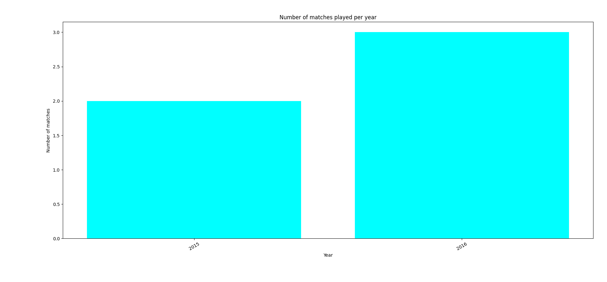
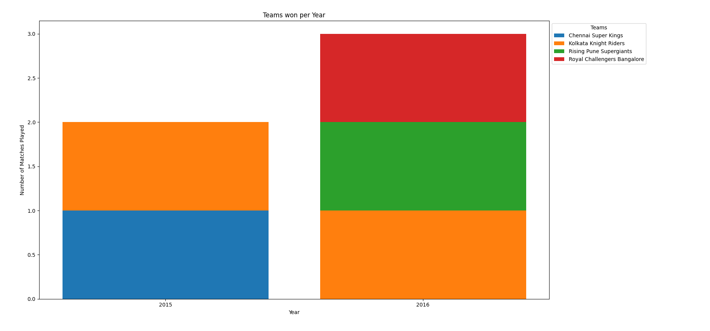
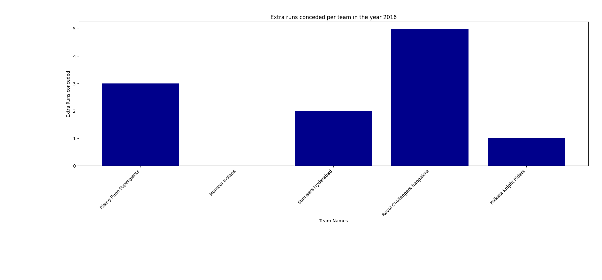
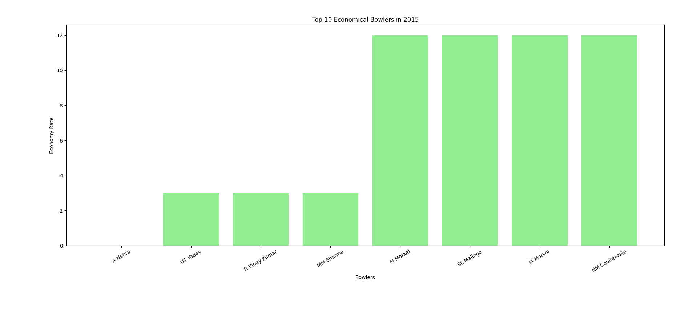

# Task1:
## File format:
```
├── data
│   └── test_deliveries_lessdata.csv
│   └── test_matches.csv
└── Task
    ├── task1.py
    ├── task2.py
    └── task3.py
    └── task4.py
    └── task_task1.py
    └── task_task2.py
    └── task_task3.py
    └── task_task4.py
```

## Codes: 
Open task1.py and run the script execute1() function will take care of everything.

Open task2.py and run the script execute2() function will take care of everything.

Open task3.py and run the script execute3() function will take care of everything.

Open task4.py and run the script execute4() function will take care of everything.

## coverage
